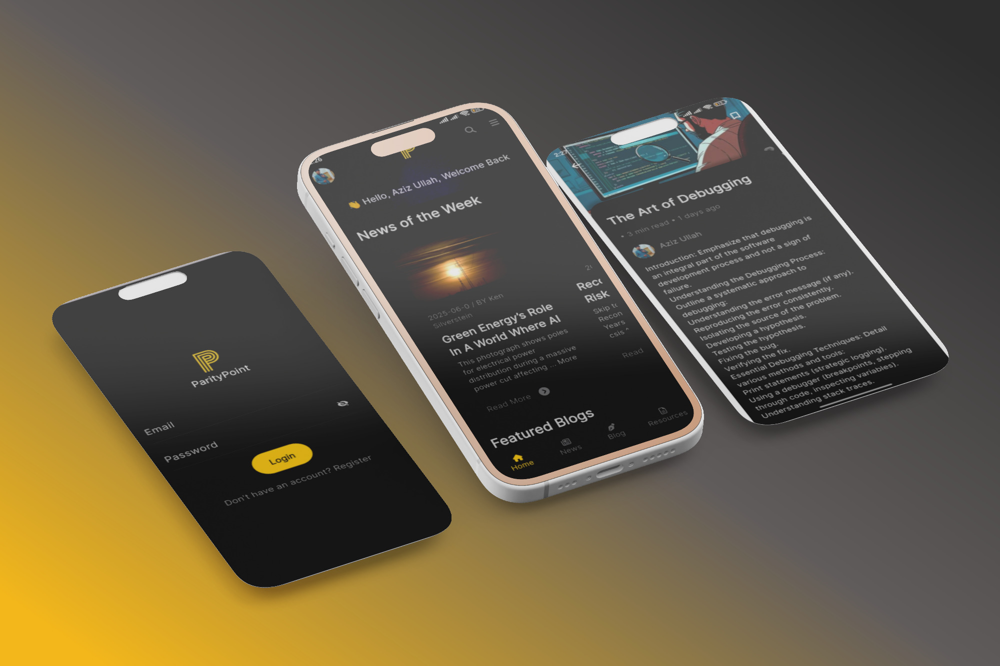

# ParityPoint

## Project Overview

**ParityPoint** is a platform designed for developers and tech learners to form communities, write blogs, and access a centralized hub of resources. The platform enables users to engage with one another, share knowledge, and discover valuable tech insights. It provides a mix of self-uploaded resources and curated references from other websites, offering a dynamic learning and problem-solving experience powered by AI and automation.

This repository is specifically for the **ParityPoint** mobile application code, built using **Flutter** for the frontend and integrated with the **Fastify** backend API.

---

## Tech Stack 🛠️

### Frontend
-  Framework for building the mobile app.
-  Programming language for Flutter.

### Backend
-  High-performance web framework for Node.js.
-  NoSQL database for storing application data.
-  For secure authentication.

### Frontend
- **Flutter**: Framework for building the mobile app.
- **Dart**: Programming language for Flutter.

### Backend
- **Fastify**: High-performance web framework for Node.js.
- **MongoDB**: NoSQL database for storing application data.
- **JWT (JSON Web Tokens)**: For secure authentication.

---

## Project Structure

The project is organized into two main directories to separate the frontend and backend:

```
/ParityPoint
├── /backend               # Fastify API (Backend)
│   ├── /controllers       # Controller files
│   ├── /models            # MongoDB models
│   ├── /routes            # API routes
│   ├── /utils             # Utility functions
│   ├── .env               # Environment variables
│   ├── server.js          # Fastify server setup
│   └── package.json       # Backend dependencies
│
└── /frontend              # Flutter mobile app (Frontend)
    ├── /lib               # Flutter app source code
    ├── /assets            # App assets (images, fonts, etc.)
    ├── pubspec.yaml       # Flutter dependencies
    └── android            # Android-specific files (for building APK)
```

---

## Features

### User Account Management
- Easy sign-up and login process
- Profile customization
- Secure authentication using JWT
- Password reset functionality

### Community Features
- Create and join tech communities
- Follow other developers
- Real-time messaging between users
- Discussion forums for tech topics

### Content Creation
- Write and publish technical blogs
- Code snippet sharing
- Resource link sharing
- Rich text formatting support

### Learning Resources
- Curated learning paths
- Technical documentation access
- Integration with external learning platforms
- Bookmarking favorite resources

### Social Features
- Share content across platforms
- User mentions and notifications
- Activity feed

### AI-Powered Features (Future)
- Smart content recommendations
- Code analysis suggestions
- Automated resource categorization
- Search optimization

## Code Structure

My Flutter application follows the MVVM (Model-View-ViewModel) design pattern, which is a widely used architecture in Flutter when using state management libraries like provider.

Model:
This layer includes data classes and services that interact with external APIs or local storage (e.g., user model, resource model, API calls). It represents the business domain and application data.

View:
The UI components (Flutter widgets) are considered the View. Pages like the login screen, home page, user profile, and search screen are part of this layer. These widgets are responsible only for displaying data and capturing user input.

ViewModel (or Controller):
This layer lies between the Model and View. It contains the presentation logic and interacts with the model to fetch/update data. In this app, ViewModels are implemented using the ChangeNotifier class from the provider package to manage and notify UI of state changes.

Additional Notes:
State Management: The app uses the provider package, which aligns well with MVVM. Each ViewModel extends ChangeNotifier to expose data and methods for the UI to bind to.

Separation of Concerns: Each component is clearly separated, which makes the codebase scalable and testable.

Modularity: Code is organized into logical directories such as models/, views/, view_models/, and services/.

## Mockups




## Video Link

https://youtube.com/shorts/hFDFx963N2E?si=S5ULvheFEXCkDlVD

## Getting Started

To get the project up and running locally, follow the instructions below to set up both the frontend and backend.

### Clone the repository

```bash
git clone https://github.com/your-username/ParityPoint.git
cd ParityPoint
```

### Install Backend Dependencies

1. Navigate to the `backend` directory:

   ```bash
   cd backend
   ```

2. Install backend dependencies using npm:

   ```bash
   npm install
   ```

3. Create a `.env` file for environment variables, such as MongoDB URI and JWT secret. Example:

   ```
   MONGO_URI=mongodb://localhost:27017/paritypoint
   JWT_SECRET=your_jwt_secret
   ```

4. Start the Fastify server:

   ```bash
   npm start
   ```

   The backend API will now be running on `http://localhost:3000`.

### Install Frontend Dependencies

1. Navigate to the `frontend` directory:

   ```bash
   cd frontend
   ```

2. Install Flutter dependencies:

   ```bash
   flutter pub get
   ```

3. Update the `base_api_url` in the Flutter app to match your backend URL (typically in a configuration file or constant):

   ```dart
   String baseApiUrl = "http://localhost:3000";  // Update this URL as needed
   ```

4. Run the Flutter app:

   ```bash
   flutter run
   ```

   The app should now be running on your mobile device or emulator.

---

## Backend Setup

1. **Install Fastify and MongoDB**:

   The backend uses Fastify to handle API requests and MongoDB for data storage. You can set up MongoDB on your local machine or use a cloud service like MongoDB Atlas.

2. **Environment Variables**:

   Create a `.env` file in the backend directory with the following:

   ```
   MONGO_URI=your_mongodb_connection_uri
   JWT_SECRET=your_jwt_secret
   ```

   Replace `your_mongodb_connection_uri` with your actual MongoDB URI and `your_jwt_secret` with a secret key for JWT authentication.

3. **Start the Backend Server**:

   Run the following command to start the Fastify server:

   ```bash
   npm start
   ```

   The server will be available at `http://localhost:3000`.

---

## Frontend Setup

1. **Install Flutter and Dependencies**:

   Make sure you have Flutter installed. You can follow the installation guide on the [Flutter website](https://flutter.dev/docs/get-started/install).

2. **Set API URL**:

   Update the `baseApiUrl` variable in the app code to point to your backend API URL.

3. **Run the Flutter App**:

   Run the following command to start the Flutter app:

   ```bash
   flutter run
   ```

   The app will be available on your mobile device or simulator.

---

## Contributing

We welcome contributions to ParityPoint! To contribute:

1. Fork the repository.
2. Create a new branch for your feature or bug fix.
3. Write tests if applicable.
4. Submit a pull request with a description of your changes.

Please ensure your code adheres to the project’s coding standards and passes all tests.

---